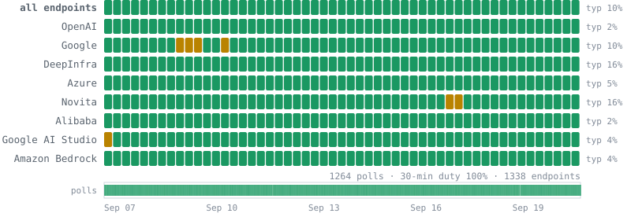
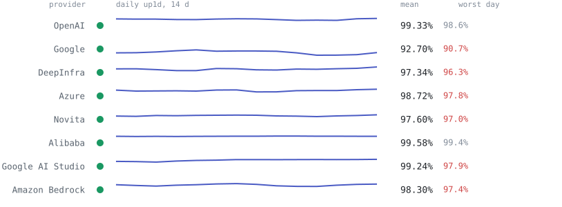

# OpenRouter Uptime

An independent, git-timestamped uptime registry for **every model on
[OpenRouter](https://openrouter.ai)** and each of its inference providers.

Two independent collectors poll OpenRouter's public API every 15 minutes --
a Railway cron as the primary and a GitHub Action as the fallback, each
standing down when the other has polled recently. Every run saves the raw
responses, records the status of every routing endpoint (~1,150 across ~400
catalog models) plus provider metadata, and commits the result. Every poll is
a timestamped snapshot in `raw/` and `derived/`, so any endpoint's
availability can be reconstructed over time from the files themselves.
Measured sampling characteristics -- duty cycle, gaps, per-hour density --
are published in [`status/coverage.json`](status/coverage.json).

No API key required. Everything comes from OpenRouter's public endpoints.

**Mirrors:** this repo is the source of truth; a tidy Parquet copy is refreshed
daily on
[HuggingFace](https://huggingface.co/datasets/venvoo/openrouter-uptime) and
[Kaggle](https://www.kaggle.com/datasets/spicycorn/openrouter-uptime).

<picture>
  <source media="(prefers-color-scheme: dark)" srcset="status/strip-dark.svg">
  
</picture>

<picture>
  <source media="(prefers-color-scheme: dark)" srcset="status/providers-dark.svg">
  
</picture>

## What's in here

Three committed folders: `raw/` (verbatim archives), `derived/` (tidy CSVs),
`status/` (current snapshots and change logs).

| path | contents |
|---|---|
| `raw/YYYY-MM-DD/HHMMSS.json.gz` | ground truth: the verbatim `/models`, `/providers` (formerly `/all-providers`), and every `/endpoints` API response for that run. Everything below is derived from these and can be rebuilt with `scripts/reparse.py`. |
| `derived/YYYY-MM-DD.csv` | one row per endpoint per poll: `ts, model, provider, endpoint_tag, endpoint_id, identity_ambiguous, state, status, up5m, up30m, up1d`. Endpoint identity is `(model, endpoint_id)` — provider name alone is not unique, since one provider can serve several endpoints for the same model. `endpoint_id` is the tag when it is unique; duplicate tags carry a `#fingerprint` of their descriptive fields, and endpoints indistinguishable even by that carry a further `#N` in array order (Baseten has published such pairs since 2026-09-01). Rows with `identity_ambiguous=true` are real readings but not a longitudinal series: the suffix is not stable across polls, and `incidents.jsonl` skips them. `state` is `unknown` when the endpoint fetch itself failed. |
| `status/latest.json` | most recent full endpoint snapshot |
| `status/incidents.jsonl` | append-only outage log; each line is an endpoint transition that touches `down` (note `recovered` can mean down→degraded, not necessarily full health — check `to`). Carries `previous_ts`, `observation_gap` and `minutes_since_last_seen`, so transitions bridged across sampling gaps are marked rather than silent. Rebuilt verbatim from `raw/` by `scripts/rebuild_history.py`; `scripts/audit.py` fails if the two ever differ |
| `status/models.json` | live model catalog, refreshed every run (on catalog-fetch failure the last good snapshot is reused and uptime readings continue) |
| `status/model_changes.jsonl` | append-only log of models added to or removed from OpenRouter, plus catalog fetch outages |
| `status/providers.json` | each provider's metadata (HQ, ToS/privacy/status-page URLs). Until 2026-07-15 it also carried OpenRouter's reported data policy (training, prompt retention, moderation); upstream stopped publishing it, so `data_policy` is null after that date (last-known values remain in `raw/`) |
| `status/provider_changes.jsonl` | append-only log of providers added/removed, data-policy edits (pre-2026-07-15), ToS/privacy/status-page URL edits, and fetch outages (the providers surface is best-effort; uptime readings continue through its failures) |

The README's **Systemic events** section (below) is regenerated every run by
`scripts/readme_events.py`: it surfaces only fleet-level signals from those
logs — batch catalog changes (>=3 models in one poll), provider exits, fetch
outages, and upstream schema breaks — and skips per-model churn.

**State** comes from OpenRouter's 30-minute uptime figure:
`up` (>=98%), `degraded` (50 to 98%), `down` (<50% or non-OK status),
`idle` (no recent traffic, not a fault).

## Why raw is kept

The derived CSV/JSON reflect one interpretation of the API. If that parsing is
ever wrong, or we later want a field we didn't extract, `raw/` holds the
complete original response for every run, so nothing is lost to a parser bug.
`python3 scripts/reparse.py raw/.../HHMMSS.json.gz` regenerates the derived rows
from any archive.

## Use the data

```bash
grep anthropic/claude-sonnet derived/$(date -u +%F).csv   # one model, today
jq 'select(.event=="down")' status/incidents.jsonl        # every outage start
python3 scripts/reparse.py raw/2026-07-04/140117.json.gz  # rebuild from raw
ls raw/                                                   # one folder per day
```

## Notes

- Keyless: `poll.py` uses only OpenRouter's public API.
- Schedulers are best-effort; the `ts` column records the true poll time, and
  `status/coverage.json` records what was actually achieved. Until 2026-08-06
  the collector ran hourly at best (21.6% duty cycle for the 30-minute
  window); judge the early series by the coverage file, not the schedule.
- Raw archives are ~160 KB gzipped per run (~15 MB/day at the 15-min cadence).
- OpenRouter's uptime figures are its own measurements of its routing layer.
- Built to study AI-infrastructure dependence; contributions welcome.

<!-- AUTOGEN:STATUS -->

## Current status (2026-09-25T23:30:19+00:00 UTC)

459 models polled, 1410 inference endpoints:
up 858, degraded 86, down 13, idle 453.

Currently down (13):

| model | endpoint | provider | 30m uptime | 5m uptime |
|---|---|---|---|---|
| `deepseek/deepseek-chat-v3.1` | `google-vertex/us-west2` | Google | n/a | n/a |
| `deepseek/deepseek-v4.1-flash` | `inference-net` | InferenceNet | 52% | 99% |
| `google/gemma-4-31b-it` | `chutes/fp4` | Chutes | 57% | n/a |
| `minimax/minimax-m2.5` | `digitalocean` | DigitalOcean | n/a | n/a |
| `openai/gpt-6-luna` | `amazon-bedrock/us-east-1` | Amazon Bedrock | 0% | 0% |
| `openai/gpt-oss-120b` | `google-vertex/global` | Google | 51% | 68% |
| `openai/gpt-oss-120b` | `siliconflow/fp8` | SiliconFlow | 0% | n/a |
| `openai/gpt-oss-120b` | `deepinfra/fp8` | DeepInfra | 79% | n/a |
| `qwen/qwen3-next-80b-a3b-instruct` | `novita/bf16` | Novita | 70% | 63% |
| `qwen/qwen3-vl-30b-a3b-instruct` | `siliconflow/fp8` | SiliconFlow | 59% | 80% |
| `xiaomi/mimo-v2.5` | `gmicloud/fp8` | GMICloud | 60% | n/a |
| `xiaomi/mimo-v2.5` | `venice/fp8` | Venice | 65% | n/a |
| `z-ai/glm-5` | `amazon-bedrock` | Amazon Bedrock | 18% | n/a |

Full snapshot: [`status/latest.json`](status/latest.json). Outage log: [`status/incidents.jsonl`](status/incidents.jsonl).

<!-- AUTOGEN:EVENTS:BEGIN -->

### Systemic events
_Fleet-level changes extracted from the change logs every run; per-model churn is omitted._

- **2026-09-08 20:31** — provider `ncompass` left the platform.
- **2026-09-08 21:45** — provider `prime-intellect` left the platform.
- **2026-09-09 21:31** — provider `inference-net` changed its status page.
- **2026-09-10 02:01** — **5 models added to the catalog in one poll**: `mistralai/codestral-2508:batch`, `mistralai/ministral-8b-2512:batch`, `mistralai/mistral-large-2512:batch`, `mistralai/mistral-medium-3.1:batch`, `mistralai/mistral-small-2603:batch`.
- **2026-09-11 13:01** — **3 models added to the catalog in one poll**: `~openai/gpt-astra-latest`, `~openai/gpt-luna-latest`, `~openai/gpt-terra-latest`.
- **2026-09-18 00:45** — provider `typesafe` changed its terms of service url.
- **2026-09-18 00:45** — provider `typesafe` changed its privacy policy url.
- **2026-09-22 05:39** — **6 models added to the catalog in one poll**: `nex-agi/nex-n2.5-mini`, `nex-agi/nex-n2.5-pro`, `x-ai/grok-4.7`, `xiaomi/mimo-v2.6-flash`, `xiaomi/mimo-v2.6-pro`, `xiaomi/mimo-v2.6-pro-ultraspeed`.
- **2026-09-22 05:39** — **7 models removed from the catalog in one poll**: `anthropic/claude-opus-4`, `minimax/minimax-m3:batch`, `moonshotai/kimi-k3:batch`, `openai/gpt-oss-120b:batch`, `qwen/qwen3.5-9b:batch`, `qwen/qwen3.8-2.4t-a95b:batch`, `thinkingmachines/inkling:batch`.
- **2026-09-22 18:54** — **13 models added to the catalog in one poll**: `anthropic/claude-opus-5.5`, `anthropic/claude-opus-5.5:batch`, `deepseek/deepseek-v4.1-flash:batch`, `moonshotai/kimi-k3:batch`, `openai/gpt-6-luna`, `openai/gpt-6-luna-pro`, `openai/gpt-6-luna-pro:batch`, `openai/gpt-6-luna:batch`, +5 more.
- **2026-09-22 18:54** — **5 models removed from the catalog in one poll**: `deepseek/deepseek-v4-flash-0731:batch`, `deepseek/deepseek-v4-flash-vision-exp:batch`, `deepseek/deepseek-v4-pro-0813:batch`, `meta/muse-glimmer-30b:batch`, `z-ai/glm-5.2:batch`.
- **2026-09-23 14:59** — **4 models added to the catalog in one poll**: `aion-labs/aion-3.5`, `aion-labs/aion-3.5-mini`, `stealth/space-bunny-alpha`, `upstage/solar-mini4`.

Full logs: [`status/model_changes.jsonl`](status/model_changes.jsonl), [`status/provider_changes.jsonl`](status/provider_changes.jsonl).

<!-- AUTOGEN:EVENTS:END -->

